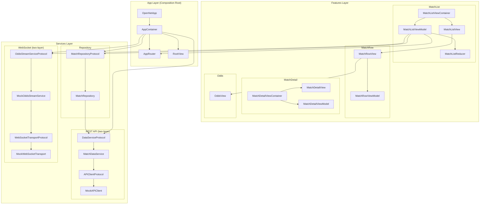
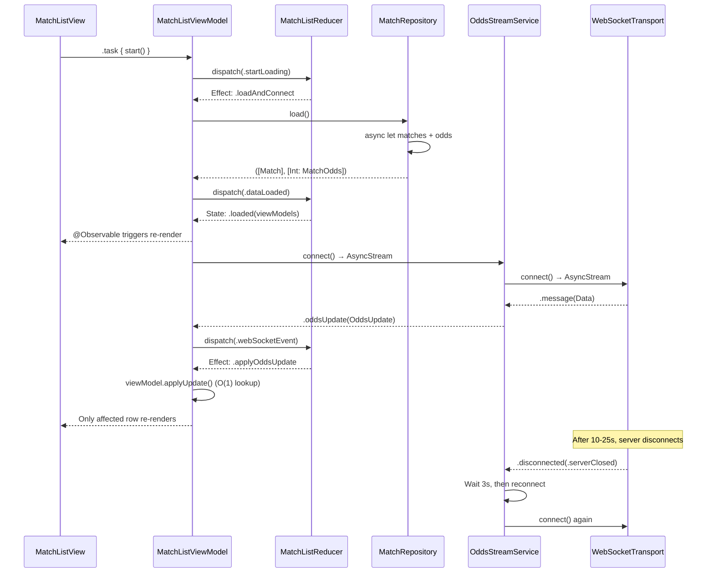
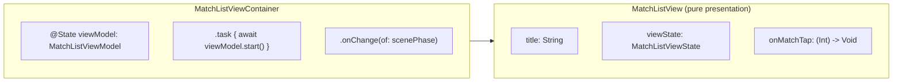
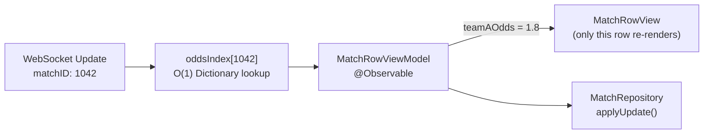
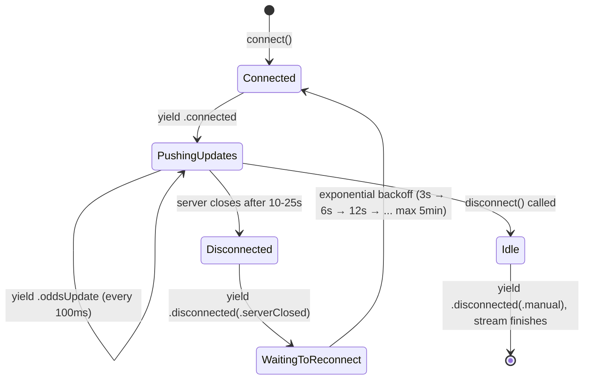
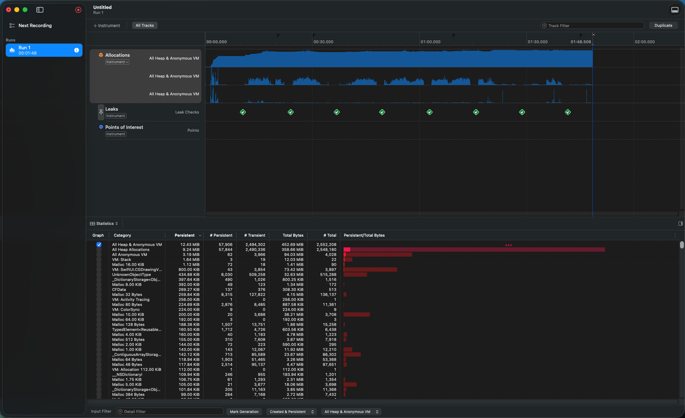

# OpenNet - Live Odds System

A SwiftUI application that displays real-time sports match odds with WebSocket updates, built as an iOS take-home assignment.

## Requirements

- Xcode 26.3
- iOS 26+

## Demo Video

[Demo Video](https://drive.google.com/file/d/1bfy5dcxo2bWbHvg26qxqQTCE44HI-E1C/view?usp=drive_link)

## Architecture Overview



### Data Flow



---

## Swift Concurrency / Combine Usage

### Where Swift Concurrency is Used

| Feature | Mechanism | Why |
|---------|-----------|-----|
| REST API calls | `async/await` | Natural error propagation with `throws` |
| Concurrent fetching | `async let` | Parallel fetch matches + odds, halving latency |
| WebSocket event stream | `AsyncStream` | Bridge push-based events into `for await` loop |
| View lifecycle | `.task` modifier | Auto-cancel on view disappear, no manual cleanup |
| Timer simulation | `Task.sleep` | Lightweight, cancellation-aware timing |
| Repository isolation | `actor` | Compile-time thread safety for shared mutable state |

### Concurrent Data Fetching with `async let`

`MatchRepository` fetches matches and odds in parallel:

```swift
async let matchList = dataService.fetchMatches()
async let oddsList  = dataService.fetchOdds()
let (fetchedMatches, fetchedOdds) = try await (matchList, oddsList)
```

**Combine alternative:** `Publishers.Zip(matchesPublisher, oddsPublisher)`, but `async let` reads more naturally and integrates with `throws` without extra error-handling operators.

**GCD alternative:** Use `DispatchGroup` to synchronize concurrent API calls — `group.enter()` before each request, `group.leave()` in the completion handler, and `group.notify(queue: .main)` to proceed when both complete. For thread safety on shared mutable state, use a concurrent `DispatchQueue` with the `.barrier` flag: reads execute concurrently, but writes are serialized via `queue.async(flags: .barrier)`, preventing race conditions without blocking readers.

### WebSocket Event Stream with `AsyncStream`

Layer 1 (Transport) manages a single connection and pushes raw events:

```swift
func connect(url: URL, token: String?) -> AsyncStream<WebSocketRawEvent>
```

Layer 2 (Service) wraps transport with reconnection and JSON decoding:

```swift
while !Task.isCancelled {
    for await rawEvent in transport.connect(url: url, token: token) {
        // decode raw JSON → typed OddsUpdate, yield to consumer
    }
    // Stream ended (server disconnected) — wait 3s, then reconnect
    try? await Task.sleep(for: .seconds(3))
}
```

**Combine alternative:** Model as `PassthroughSubject<WebSocketEvent, Never>` with manual subscription management. `AsyncStream` was chosen because it composes naturally with `for await` and integrates with Swift's task cancellation without retain-cycle concerns from `AnyCancellable` storage.

**Delegate / Closure alternative:** The WebSocket transport interface could also be designed with a delegate protocol (`func didReceive(event:)`) or closure callbacks (`onEvent: (WebSocketRawEvent) -> Void`). `AsyncStream` was chosen because it unifies the push-based transport into a pull-based `for await` loop, making the consumer code linear and easier to reason about. Delegate and closure approaches work well in UIKit/ObjC codebases but require more manual state management for reconnection logic.

### View Lifecycle with `.task`

```swift
.task {
    await viewModel.start()
}
```

When the view disappears, `.task` cancels the underlying `Task`, which propagates through `Task.isCancelled` checks in the WebSocket reconnection loop, cleanly tearing down the connection.

**UIKit alternative:** Store the `Task` in the ViewController and cancel it in `viewDidDisappear` or `deinit`.

**Combine alternative:** Store `AnyCancellable` in the ViewController, cancelled automatically on `deinit`.

---

## Thread Safety

### `@MainActor` for ViewModels

```swift
@Observable
@MainActor
final class MatchListViewModel { ... }
```

All ViewModel state mutations are isolated to `@MainActor`. The compiler enforces this — any attempt to mutate these properties from a non-MainActor context produces a compile-time error. This guarantees:

- All property reads and writes happen on the main thread
- UI updates triggered by `@Observable` are already on the main thread
- No runtime locks, no `DispatchQueue.main.async` wrappers, no data races

**UIKit / Combine alternative:**
- Combine's `receive(on: DispatchQueue.main)` — runtime guarantee, easy to forget on one publisher chain
- `DispatchQueue.main.async` — ensure UI updates run on the main thread, but no compile-time enforcement; forgetting to dispatch is a silent bug that only manifests as a runtime crash

**GCD alternative:** Use a serial `DispatchQueue` as a synchronization mechanism — all ViewModel state reads and writes go through `queue.sync { }` or `queue.async { }`. This provides runtime isolation but the compiler cannot verify correctness. Alternatively, use `NSLock` for fine-grained locking, but it's error-prone (deadlocks, forgotten unlocks) and verbose compared to `@MainActor`.

### `actor` for MatchRepository

```swift
actor MatchRepository: MatchRepositoryProtocol {
    private(set) var cachedMatches: [Match] = []
    private(set) var cachedOddsMap: [Int: MatchOdds] = [:]
    ...
}
```

`MatchRepository` is a shared mutable state container accessed by multiple entry points (`load`, `forceLoad`, `applyUpdate`). Using `actor` provides compile-time guaranteed isolation — all property accesses are serialized through the actor's executor, eliminating data races without manual locking.

**Why `actor` over `@MainActor`?** Repository work (fetching, caching) doesn't need to run on the main thread. `actor` keeps it on the cooperative thread pool, freeing the main thread for UI work.

**GCD alternative:** Use a concurrent `DispatchQueue` with the reader-writer pattern — reads execute concurrently via `queue.sync { }`, writes are serialized via `queue.async(flags: .barrier) { }`. This allows multiple concurrent reads while ensuring writes have exclusive access, preventing race conditions. However, it's a runtime-only guarantee with no compile-time safety, and forgetting to wrap an access in the queue is a silent data race.

**Other alternatives:**
- `NSLock` — fine-grained but error-prone (deadlocks, forgotten unlocks)
- Serial `DispatchQueue` — simpler than reader-writer but serializes all access including reads, reducing concurrency

---

## UI-ViewModel Data Binding

### Unidirectional Data Flow

The core principle behind UI-ViewModel binding is **unidirectional data flow**: all user actions flow through a single dispatch path to update the source of truth (state), and the UI reacts to state changes. This keeps the data flow clean and predictable — the UI never mutates state directly, it only sends actions:

```
User Action → dispatch(Action) → Reducer → new State → UI re-renders
```

This pattern applies regardless of framework: in SwiftUI via `@Observable`, in UIKit via delegate callbacks, closure or KVO, in Combine via `@Published` + `sink`. The key is that data flows in one direction — never from the View back to the State without going through the action/reducer path.

### Container / View Separation

Each feature uses a two-layer view pattern:



**Container** owns the ViewModel and bridges observable state to raw values. **View** accepts only primitive types and closures — no dependency on any ViewModel, service, or DI container.

**Why this split?** Previews need zero mock objects — just raw data. Without it, previewing requires constructing the entire dependency graph.

**UIKit alternative:** The Container becomes a `UIViewController` subclass that creates the ViewModel and configures a `UITableView`. The "pure view" equivalent is a `UITableViewCell` subclass that exposes `configure(title:odds:)` methods with value types.

### Per-Cell Reactive Updates with `@Observable`



Each match row has its own `@Observable` ViewModel. When a WebSocket update arrives:

1. O(1) lookup via `oddsIndex` dictionary (not O(n) array scan)
2. Mutate only that row's `teamAOdds` / `teamBOdds`
3. SwiftUI re-renders only the affected row — not the entire list

With 100 matches and up to 10 updates/second, the dictionary avoids 100,000 comparisons/second that `Array.first(where:)` would require.

**UIKit alternative:** Compare the incoming matchID against the data source to find the corresponding `IndexPath`, then use `tableView.cellForRow(at:)` to get the visible cell and directly update its labels — no `reloadRows` or `reloadData` needed. This is the most efficient approach: zero diffing overhead, zero cell recreation, just a direct property assignment on the existing `UILabel`. Alternatively, `UITableViewDiffableDataSource` with `NSDiffableDataSourceSnapshot` can handle batch updates and insertions/deletions automatically.

**Combine alternative:** Each cell subscribes to a per-row `AnyPublisher<MatchOdds, Never>`, filtered by matchID. Cell reuse requires careful subscription management in `prepareForReuse()`.

### Known Re-render: `connectionStatus`

`MatchListViewContainer` passes both `viewState` and `connectionStatus` to `MatchListView`. When `connectionStatus` changes (connect/disconnect), `MatchListView`'s body re-evaluates. However, SwiftUI's diff engine detects that row identities and data haven't changed, so **no rows actually re-render**. Since `connectionStatus` changes infrequently (only on connect/disconnect events, not on every odds update), this is an acceptable trade-off over adding architectural complexity to isolate it.

### Odds Flash Animation

`OddsView` uses `onChange(of:)` to animate color flashes when odds change:

```swift
.onChange(of: oddsValue) { oldValue, newValue in
    let color = newValue > oldValue ? colorScheme.riseColor : colorScheme.fallColor
    withAnimation(.easeIn(duration: 0.2)) { flashColor = color }
    withAnimation(.easeOut(duration: 1).delay(0.2)) { flashColor = .clear }
}
```

The color convention is market-specific: Western markets use green for rise / red for fall; Asian markets reverse this.

**UIKit alternative:** `UIView.animate(withDuration:)` on the cell's background color, triggered by comparing old vs. new values in `configure()`.

---

## Bonus Features

### WebSocket Auto-Reconnect



Reconnection is handled entirely in the service layer (`MockOddsStreamService`). The transport yields `.disconnected` when a connection drops. The service uses **exponential backoff** (3s → 6s → 12s → 24s → ... capped at 5 minutes) to avoid overwhelming the server with rapid reconnection attempts. The delay resets to 3s on a successful connection. All of this is invisible to the ViewModel.

The `DisconnectReason` enum distinguishes `.serverClosed`, `.networkError`, `.invalidURL`, and `.manual`, allowing the reducer to decide the appropriate response (e.g., increment reconnect counter vs. show error vs. go idle).

**UIKit / Combine alternative:** Use `Timer.publish` or `DispatchQueue.asyncAfter` for reconnection delay with a manually tracked backoff multiplier, and `PassthroughSubject` to re-emit events after reconnection. Requires manual `AnyCancellable` management and careful state tracking to avoid duplicate connections.

### In-Memory Cache

`MatchRepository` (actor) maintains cached data with a 5-minute TTL:

```swift
actor MatchRepository {
    private(set) var cachedMatches: [Match] = []
    private(set) var cachedOddsMap: [Int: MatchOdds] = [:]
    private var lastFetchTime: Date?

    func load() async throws -> ([Match], [Int: MatchOdds]) {
        if isCacheValid { return (cachedMatches, cachedOddsMap) }
        return try await fetchAndCache()
    }
}
```

When re-entering the match list (e.g., reopening the page), `load()` returns cached data instantly — no loading spinner, no API call. The cache also reflects real-time WebSocket updates via `applyUpdate()`, so the user sees the latest odds immediately without waiting for a network round-trip.

The current implementation uses in-memory cache with a configurable TTL (default 5 minutes). For scenarios requiring persistence across app launches, this could be extended to `UserDefaults` (for small data sets) or the file system (for larger data sets), with the same `MatchRepositoryProtocol` interface — callers would not need to change. Core Data or SQL-based solutions would only be considered if the data requires complex querying or filtering.

**UIKit / Combine alternative:** Same repository pattern works. In UIKit, the ViewController would call `repository.load()` in `viewDidLoad` and populate the `UITableView` from the cache synchronously if available.

### Memory Leak Testing

Verified with Instruments Leaks — no leaks detected during WebSocket reconnection cycles and odds update streaming.



---

## Debug Tools

### FPS Overlay

A `CADisplayLink`-based FPS counter is displayed at the bottom-right corner in DEBUG builds. It updates every second and color-codes: green (55+ FPS), yellow (45-54), red (below 45).

### View Re-render Logging

All key views (`MatchListView`, `MatchRowView`, `OddsView`) include `Self._printChanges()` in DEBUG builds. This prints to the Xcode console whenever a view's body is re-evaluated, showing exactly which property triggered the re-render. This proves that odds updates only re-render the affected row, not the entire list.

---

## Project Structure

```
OpenNet/
├── App/
│   ├── OpenNetApp.swift              → Entry point with #if DEBUG switching
│   ├── AppContainer.swift            → DI container with protocol extensions
│   ├── AppRouter.swift               → Navigation state (AppDestination enum)
│   ├── AppTheme.swift                → Market-aware theme (Asian/Western colors)
│   ├── OddsFlashColorScheme.swift    → Color rise/fall convention
│   └── RootView.swift                → NavigationStack shell + FPS overlay
├── Features/
│   ├── MatchList/
│   │   ├── MatchListView.swift       → Container + pure View + ConnectionStatusBadge
│   │   ├── MatchListViewModel.swift  → Data loading, WebSocket, navigation
│   │   ├── MatchListReducer.swift    → Pure state machine (State, Action) → (State, Effect)
│   │   └── MatchListDependencies.swift
│   ├── MatchRow/
│   │   ├── MatchRowView.swift        → Single match card layout
│   │   └── MatchRowViewModel.swift   → Per-row @Observable state + odds formatting
│   ├── MatchDetail/
│   │   ├── MatchDetailView.swift     → Container + pure detail View
│   │   ├── MatchDetailViewModel.swift
│   │   └── MatchDetailDependencies.swift
│   └── Odds/
│       └── OddsView.swift            → Reusable odds display with flash animation
├── Models/
│   ├── Match.swift                   → Match, MatchOdds, OddsUpdate (Codable + Hashable)
│   └── ConnectionStatus.swift        → ConnectionStatus, DisconnectReason, WebSocketEvent
├── Services/
│   ├── MockConstants.swift           → Shared mock configuration (matchCount, matchIDRange)
│   ├── Network/
│   │   ├── APIClientProtocol.swift   → Layer 1: generic HTTP (endpoint → Data)
│   │   └── MockAPIClient.swift       → Returns JSON for /matches, /odds
│   ├── DataService/
│   │   ├── DataServiceProtocol.swift → Layer 2: fetchMatches / fetchOdds
│   │   └── MatchDataService.swift    → Calls APIClient, decodes JSON
│   ├── WebSocket/
│   │   ├── WebSocketTransportProtocol.swift  → Layer 1: raw connection
│   │   ├── MockWebSocketTransport.swift      → Simulates 10-25s connections
│   │   ├── OddsStreamServiceProtocol.swift   → Layer 2: reconnect + decode
│   │   └── MockOddsStreamService.swift       → Auto-reconnect + JSON→OddsUpdate
│   └── MatchRepository/
│       ├── MatchRepositoryProtocol.swift → Actor protocol: cache + fetch
│       └── MatchRepository.swift        → Actor: in-memory cache, concurrent loading
├── Utilities/
│   ├── Strings.swift                 → Localized string constants
│   ├── Double+Extensions.swift       → rounded(toPlaces:)
│   └── FPSOverlay.swift              → DEBUG-only FPS counter (CADisplayLink)
└── Resources/
    └── en.lproj/Localizable.strings  → English string catalog
```

---

## Design Decisions and Trade-offs

| Decision | Trade-off |
|----------|-----------|
| SwiftUI over UIKit | Leverages `@Observable` for per-cell updates without `UITableViewDiffableDataSource` boilerplate. Loses fine-grained `UITableView` cell reuse control. |
| `@Observable` (iOS 17+) over `ObservableObject` | Eliminates `@Published` wrapper noise and enables automatic dependency tracking. Requires iOS 17 minimum deployment target. |
| `@MainActor` for ViewModels | Compile-time thread safety vs. runtime-only guarantees. Cannot use `@MainActor` properties in `deinit`. |
| `actor` for MatchRepository | Compile-time isolation for shared mutable state. Requires `await` for all property access, but eliminates data race risk entirely. |
| Two-layer networking (REST + WebSocket) | Clean separation of transport/service. Mock at Layer 1 exercises the full decode path. Production swap only touches Layer 1. |
| Container/View split | Zero-cost previews and testable Views, at the cost of one extra struct per feature. |
| `Dictionary` odds index | O(1) update lookup vs. O(n) `Array.first(where:)`.|
| Reducer pattern | Pure function `(State, Action) → (State, Effect)` makes state transitions testable without mocking. Adds indirection vs. direct ViewModel logic. |
| Feature-scoped DI protocols | Each feature declares its own dependency needs. Adds one protocol per feature but achieves full dependency inversion. |

---

## Testing

56 unit tests covering:

| Test Suite | Count | Coverage |
|------------|-------|----------|
| `MatchListReducerTests` | 24 | All state transitions: startLoading, dataLoaded, dataFailed, enterBackground, becomeActive, WebSocket events (connect, disconnect, consecutive reconnect, odds update), matchTapped |
| `MatchRepositoryTests` | 13 | Cache hit/miss/expiry, forceLoad (including cache update), applyUpdate (including cache validity), error propagation |
| `MatchRowViewModelTests` | 11 | Init, formatting, applyUpdate, Equatable |
| `MatchListViewModelTests` | 8 | Integration: start (success/failure), refresh, enterBackground, becomeActive reconnect, retry after error, navigation, odds update propagation |

---

## What's Not Implemented

- **Production networking** — Only Layer 1 needs production implementations: `URLSessionAPIClient` (conforming to `APIClientProtocol`) and `URLSessionWebSocketTransport` (conforming to `WebSocketTransportProtocol`). Layer 2 services work unchanged.
- **Subscribe/Unsubscribe** — the `OddsStreamServiceProtocol` documents the API shape for selective match subscription. Currently mocked as push-all.
